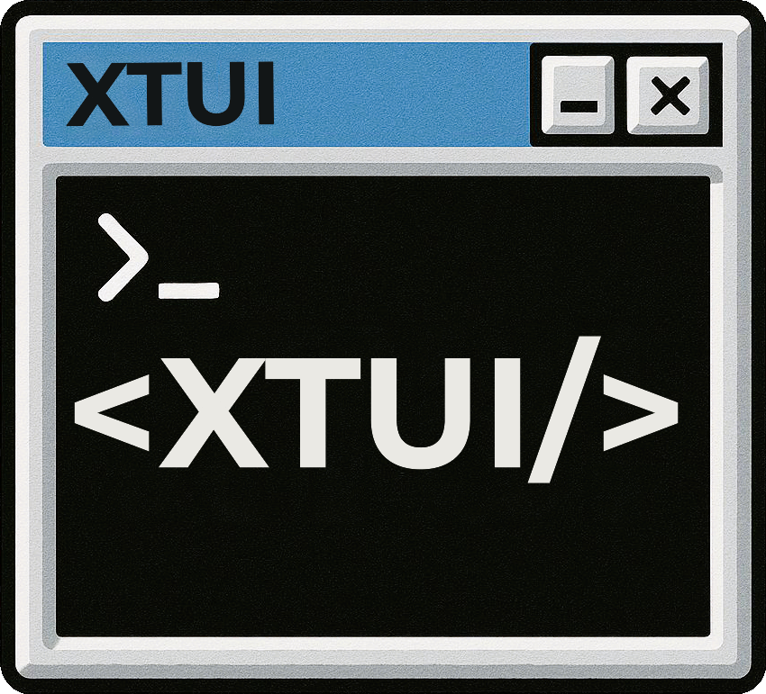

# Terminal.Gui.Xtui

## Terminal.Gui.Xtui has moved to [https://gitlab.com/vmaxxer09/Terminal-Gui-Xtui](https://gitlab.com/vmaxxer09/Terminal-Gui-Xtui). Please visit for the latest mirrored code!



A Roslyn source generator that enables XML-based UI design, similar to XAML, for [Terminal.Gui v2](https://github.com/gui-cs/Terminal.Gui) applications. Write your terminal UIs declaratively using XTUI (XAML Terminal User Interface) syntax, and let the generator produce clean, efficient C# code at compile time.

## Overview

Terminal.Gui.Xtui brings declarative UI design to Terminal.Gui through a compile-time source generator. Inspired by Microsoft's XAML implementation, this project allows you to define terminal-based user interfaces using familiar XML syntax while maintaining Terminal.Gui's performance characteristics.

> **Note:** Terminal.Gui.Xtui is in constant development. While the core features are stable, new controls and capabilities are regularly added. Or changed. Concepts are being defined and refined. Any ideas and feedback are welcome. Please report any issues or feature requests on the [GitHub repository](https://github.com/johnmbaughman/Terminal.Gui.Xtui/issues).

### Key Features

- **Compile-Time Code Generation**: `.xtui` files are transformed into C# code during compilation using Roslyn incremental source generators
- **Zero Runtime Overhead**: No parsing at runtime—generated code directly instantiates Terminal.Gui controls
- **Type-Safe**: Leverages C#'s type system with compile-time validation
- **InitializeComponent Pattern**: Follows the familiar WPF/WinForms pattern with partial classes
- **Rich Layout Support**: Full support for Terminal.Gui's `Pos` and `Dim` positioning system including operators and view references
- **View Reference Positioning**: Reference other controls in positioning expressions: `X="{Right _usernameLabel + 1}"`
- **Automatic Discovery**: `.xtui` files are automatically detected and processed when Terminal.Gui is referenced
- **IDE Integration**: Generated files visible in your IDE under `obj/Generated` folder
- **Full IntelliSense Support**: Auto-generated XSD schema provides autocomplete, validation, and documentation for all 51 Terminal.Gui controls

## Getting Started

### Prerequisites

- .NET 8.0 SDK or later
- Terminal.Gui v2 (referenced as submodule or package)
- Any IDE with C# support (Visual Studio, VS Code, Rider)

### Installation

1. **Clone the repository with submodules:**

```bash
git clone --recurse-submodules https://github.com/johnmbaughman/Terminal.Gui.Xtui.git
cd Terminal.Gui.Xtui
```

If you already cloned without `--recurse-submodules`:

```bash
git submodule update --init --recursive
```

2. **Build the solution:**

```bash
dotnet build src/Terminal.Gui.Xtui.sln
```

3. **Run the example:**

```bash
# Run the best example - a complete login form
dotnet run --project src/Examples/ExampleLogin

# Try the comprehensive UI catalog showcase
dotnet run --project src/Examples/UICatalogXtui

# Or try the basic example
dotnet run --project src/Examples/Xtui
```

## Project Structure

```
Terminal.Gui.Xtui/
├── src/
│   ├── Terminal.Gui/                       # Git submodule (Terminal.Gui v2)
│   ├── Terminal.Gui.Xtui/                  # Source generator library
│   │   ├── CodeGenerator.cs                # Roslyn incremental source generator
│   │   ├── XtuiLoader.cs                   # XTUI parser (using System.Xml.Linq)
│   │   ├── ElementNode.cs                  # Internal XTUI tree representation
│   │   ├── Generators/                     # Control-specific code generators
│   │   │   ├── WindowGenerator.cs          # Generates Window with InitializeComponent
│   │   │   ├── LabelGenerator.cs           # Label generator
│   │   │   ├── ButtonGenerator.cs          # Button generator
│   │   │   ├── CheckBoxGenerator.cs        # CheckBox generator
│   │   │   ├── TextFieldGenerator.cs       # TextField generator
│   │   │   ├── ListViewGenerator.cs        # ListView generator
│   │   │   ├── GenericGenerator.cs         # Fallback for other controls
│   │   │   ├── GeneratorFactory.cs         # Factory for selecting generators
│   │   │   └── ObjectParsingHelpers.cs     # Pos/Dim expression parsing
│   │   ├── Mappers/                        # Type mappers
│   │   │   └── EnumMapper.cs               # Enum value mapping
│   │   ├── Terminal.Gui.Xtui.xsd           # XML Schema for IntelliSense (auto-generated)
│   │   └── buildTransitive/                # MSBuild integration
│   │       └── Terminal.Gui.Xtui.targets   # Automatic .xtui file discovery
│   ├── Terminal.Gui.Xtui.XsdGenerator/     # XSD schema generator
│   │   ├── Program.cs                      # Reflects over Terminal.Gui assembly
│   │   └── Terminal.Gui.Xtui.XsdGenerator.csproj
│   ├── Examples/
│   │   |── ExampleLogin/                   # Recreation of Terminal.Gui Example project
│   │   |   ├── ExampleLogin.xtui           # XTUI UI definition
│   │   |   ├── ExampleLogin.cs             # Partial class with constructor
│   │   |   |── Program.cs                  # Application entry point
│   │   │   └── ExampleLogin.csproj
│   │   |── UICatalogXtui/                  # Comprehensive Terminal.Gui showcase
│   │   |   ├── Scenario.cs                 # Base class for UI scenarios
│   │   |   ├── UICatalog.cs                # Main catalog application
│   │   |   |── Program.cs                  # Application entry point
│   │   │   └── UICatalogXtui.csproj
│   │   ├── Xtui/                           # Generator working dump project
│   │   │   ├── MyWindow.xtui               # XTUI UI definition
│   │   │   ├── MyWindow.cs                 # Partial class with constructor
│   │   │   |── Program.cs                  # Application entry point
│   │   │   └── Xtui.csproj
│   │   |── Xtui.Mvvm/                      # MVVM pattern generator working dump project
│   │       ├── MyWindow.xtui
│   │       ├── MyWindow.cs
│   │       |── Program.cs                  # Includes MainViewModel
│   │       └── Xtui.Mvvm.csproj
│   ├── Terminal.Gui.Xtui.Tests/            # Unit tests (142 tests)
│   │   ├── ButtonGeneratorTests.cs         # Button generator tests
│   │   ├── CheckBoxGeneratorTests.cs       # CheckBox generator tests
│   │   ├── GenericGeneratorTests.cs        # Generic fallback generator tests
│   │   ├── LabelGeneratorTests.cs          # Label generator tests
│   │   ├── ListViewGeneratorTests.cs       # ListView generator tests
│   │   ├── MenuBarGeneratorTests.cs        # MenuBar generator tests
│   │   ├── MenuBarItemGeneratorTests.cs    # MenuBarItem generator tests
│   │   ├── MenuItemGeneratorTests.cs       # MenuItem generator tests
│   │   ├── TextFieldGeneratorTests.cs      # TextField generator tests
│   ├── Terminal.Gui.Xtui.RoslynTests/      # Roslyn integration tests (23 tests)
│   │   ├── IncrementalGeneratorTests.cs    # Full pipeline tests
│   │   ├── SmokeTests.cs                   # Infrastructure validation
│   │   └── Terminal.Gui.Xtui.RoslynTests.csprojre generator tests
│   │   └── Terminal.Gui.Xtui.Tests.csproj
│   ├── Terminal.Gui.Xtui.RoslynTests/      # Roslyn integration tests
│   │   ├── IncrementalGeneratorTests.cs    # Full pipeline tests
│   │   ├── SmokeTests.cs                   # Infrastructure validation
│   │   └── Terminal.Gui.Xtui.RoslynTests.csproj
│   └── Terminal.Gui.Xtui.Benchmarks/       # Performance benchmarks (40+ scenarios)
│       ├── XtuiLoaderBenchmarks.cs         # XTUI parsing benchmarks
│       ├── ExpressionParsingBenchmarks.cs  # Pos/Dim expression benchmarks
│       ├── BookkeepingBenchmarks.cs        # File tracking benchmarks
│       ├── GeneratorBenchmarks.cs          # All generator benchmarks (9 classes):
│       │                                   #   - Window/TopLevel/Button/Label/CheckBox
│       │                                   #   - MenuBar, TextField, ListView
│       │                                   #   - MenuItem/MenuBarItem, Generic
│       ├── Program.cs                      # BenchmarkRunner entry point
│       └── Terminal.Gui.Xtui.Benchmarks.csproj
├── .gitignore
├── .gitmodules
├── LICENSE
└── README.md
```

## Usage

### Example Projects

The repository includes four example projects demonstrating different aspects of XTUI:

| Project | Description | Best For |
|---------|-------------|----------|
| [ExampleLogin](src/Examples/ExampleLogin) | Complete login form with view references, event handling, and Terminal.Gui integration | **Best starting point** - Real-world example |
| [UICatalogXtui](src/Examples/UICatalogXtui) | Comprehensive Terminal.Gui showcase with multiple scenarios | Exploring Terminal.Gui features |
| [Xtui](src/Examples/Xtui) | Basic window with various Pos/Dim expressions | Learning Pos/Dim syntax |
| [Xtui.Mvvm](src/Examples/Xtui.Mvvm) | MVVM pattern with CommunityToolkit.Mvvm | MVVM architecture |

### ExampleLogin - Complete Login Form (Best Example)

The [ExampleLogin project](src/Examples/ExampleLogin) demonstrates a real-world login dialog with username/password fields, a login button, and a list view. This example showcases all key XTUI features including **view reference positioning**, **control IDs**, **event handling**, and **theming**.

#### Step 1: Create the XTUI File (`ExampleLogin.xtui`)

The XTUI file defines the UI layout declaratively:

```xml
<?xml version="1.0" encoding="utf-8"?>
<Window xmlns="http://schemas.terminal.gui/xtui">
    
    <!-- Username Label -->
    <Label Id="_usernameLabel" Text="Username:" X="0" Y="0" />
    
    <!-- Username TextField - positioned relative to the label using view reference -->
    <TextField Id="_userNameText" X="{Right _usernameLabel+1}" Y="0" Width="{Fill}" />
    
    <!-- Password Label -->
    <Label Id="_passwordLabel" Text="Password:" X="0" Y="2" />
    
    <!-- Password TextField - uses Secret="true" for password masking -->
    <TextField Id="_passwordText" Secret="true" X="{Right _passwordLabel + 1}" Y="2" Width="{Fill}" />
    
    <!-- Login Button - centered, marked as default (responds to Enter key) -->
    <Button Id="_btnLogin" Text="Login" X="{Center}" Y="4" IsDefault="true" />
    
    <!-- ListView at bottom - uses AnchorEnd for positioning -->
    <ListView Id="_listView" Y="{AnchorEnd}" Height="{Auto}" Width="{Auto}" />
    
</Window>
```

**Key XTUI Features Demonstrated:**

| Feature | Example | Description |
|---------|---------|-------------|
| **Control IDs** | `Id="_usernameLabel"` | Names controls for code access and positioning references |
| **View Reference Positioning** | `X="{Right _usernameLabel+1}"` | Positions relative to another control's edge |
| **Secret Text Field** | `Secret="true"` | Masks password input with bullets |
| **Default Button** | `IsDefault="true"` | Button responds to Enter key anywhere in form |
| **Anchor Positioning** | `Y="{AnchorEnd}"` | Positions from the bottom edge |
| **Fill Sizing** | `Width="{Fill}"` | Fills remaining horizontal space |
| **Auto Sizing** | `Height="{Auto}"` | Sizes based on content |

#### Step 2: Create the Partial Class (`ExampleLogin.cs`)

The partial class provides the constructor, event handlers, and business logic:

```csharp
using System.Linq;
using Terminal.Gui.App;
using Terminal.Gui.Configuration;
using Terminal.Gui.Input;
using Terminal.Gui.ViewBase;
using Terminal.Gui.Views;

namespace ExampleLogin;

public partial class ExampleLogin : Window
{
    // Static property to store the logged-in username
    public static string? UserName { get; set; }

    public ExampleLogin()
    {
        // Set the window title with quit key information
        Title = $"Example App ({Application.QuitKey} to quit)";
        
        // Call the generated InitializeComponent() method
        // This instantiates all controls defined in the XTUI file
        InitializeComponent();

        // Setup ListView data - the _listView field is generated from Id="_listView"
        if (_listView != null)
        {
            _listView.SetSource(["One", "Two", "Three", "Four"]);
        }

        // Attach login button event handler
        // The _btnLogin field is generated from Id="_btnLogin"
        if (_btnLogin != null)
        {
            _btnLogin.Accepting += OnLoginButtonAccepting;
        }
    }

    public override void EndInit()
    {
        base.EndInit();
        // Set the theme to "Anders" if available, otherwise use "Default"
        ThemeManager.Theme = ThemeManager.GetThemeNames()
            .FirstOrDefault(x => x == "Anders") ?? "Default";
    }

    private void OnLoginButtonAccepting(object? sender, CommandEventArgs e)
    {
        // Mark the event as handled to prevent further processing
        e.Handled = true;

        // Access text field values through generated fields
        if (_userNameText != null && _passwordText != null)
        {
            if (_userNameText.Text == "admin" && _passwordText.Text == "password")
            {
                MessageBox.Query("Logging In", "Login Successful", "Ok");
                UserName = _userNameText.Text;
                Application.RequestStop();
            }
            else
            {
                MessageBox.ErrorQuery("Logging In", "Incorrect username or password", "Ok");
            }
        }
    }
}
```

**Code Pattern Explained:**

1. **Partial Class Declaration**: The class is `partial` so it can be combined with the generated code
2. **InitializeComponent()**: Generated method that creates all controls from the XTUI file
3. **Generated Fields**: Controls with `Id` attributes become private fields (e.g., `_listView`, `_btnLogin`)
4. **Event Handling**: Attach events after `InitializeComponent()` using the generated fields
5. **Null Checks**: Fields are nullable, so check before use (controls might fail to generate)

#### Step 3: Create the Entry Point (`Program.cs`)

The application entry point initializes Terminal.Gui and runs the login window:

```csharp
using System;
using Terminal.Gui.App;
using Terminal.Gui.Configuration;

namespace ExampleLogin;

class Program
{
    static void Main()
    {
        // Enable configuration from all sources (files, environment, etc.)
        ConfigurationManager.Enable(ConfigLocations.All);

        // Run the application using the Run<T>() pattern
        // This automatically creates a Toplevel and adds the ExampleLogin window
        Application.Run<ExampleLogin>().Dispose();

        // Shutdown Terminal.Gui and restore the console
        Application.Shutdown();

        // Display the username after the application exits
        Console.WriteLine($@"Username: {ExampleLogin.UserName}");
    }
}
```

#### Step 4: Configure the Project File (`ExampleLogin.csproj`)

The project file references Terminal.Gui and the source generator:

```xml
<Project Sdk="Microsoft.NET.Sdk">

  <PropertyGroup>
    <OutputType>Exe</OutputType>
    <TargetFramework>net8.0</TargetFramework>
    <Nullable>enable</Nullable>
  </PropertyGroup>

  <ItemGroup>
    <!-- Reference Terminal.Gui library -->
    <ProjectReference Include="..\..\Terminal.Gui\Terminal.Gui\Terminal.Gui.csproj" />
    
    <!-- Reference the XTUI source generator -->
    <!-- OutputItemType="Analyzer" marks it as a source generator -->
    <!-- ReferenceOutputAssembly="false" prevents runtime dependency -->
    <ProjectReference Include="..\..\Terminal.Gui.Xtui\Terminal.Gui.Xtui.csproj" 
                      OutputItemType="Analyzer" 
                      ReferenceOutputAssembly="false" />
  </ItemGroup>

  <!-- Import the targets that auto-discover .xtui files -->
  <Import Project="..\..\Terminal.Gui.Xtui\buildTransitive\Terminal.Gui.Xtui.targets" />

</Project>
```

#### Generated Code (`ExampleLogin.g.cs`)

The source generator produces the following code (visible in `obj/Generated/`):

```csharp
using Terminal.Gui.Views;
using Terminal.Gui.ViewBase;

namespace ExampleLogin
{
    public partial class ExampleLogin : Window
    {
        // Private fields for controls with Id attributes
        private Label? _usernameLabel;
        private TextField? _userNameText;
        private Label? _passwordLabel;
        private TextField? _passwordText;
        private Button? _btnLogin;
        private ListView? _listView;

        private void InitializeComponent()
        {
            // Create and add the username label
            _usernameLabel = new Label() { Text = "Username:", X = 0, Y = 0 };
            this.Add(_usernameLabel);

            // Create and add the username text field
            // Uses view reference: X = right edge of _usernameLabel + 1
            _userNameText = new TextField() 
            { 
                X = Pos.Right(_usernameLabel) + 1, 
                Y = 0, 
                Width = Dim.Fill() 
            };
            this.Add(_userNameText);

            // Create and add the password label
            _passwordLabel = new Label() { Text = "Password:", X = 0, Y = 2 };
            this.Add(_passwordLabel);

            // Create and add the password text field with Secret masking
            _passwordText = new TextField() 
            { 
                Secret = true, 
                X = Pos.Right(_passwordLabel) + 1, 
                Y = 2, 
                Width = Dim.Fill() 
            };
            this.Add(_passwordText);

            // Create and add the login button (default button for Enter key)
            _btnLogin = new Button() 
            { 
                Text = "Login", 
                X = Pos.Center(), 
                Y = 4, 
                IsDefault = true 
            };
            this.Add(_btnLogin);

            // Create and add the list view at the bottom
            _listView = new ListView() 
            { 
                Y = Pos.AnchorEnd(), 
                Height = Dim.Auto(), 
                Width = Dim.Auto() 
            };
            this.Add(_listView);
        }
    }
}
```

**Generated Code Features:**

- **Private Fields**: Each control with an `Id` attribute becomes a nullable private field
- **View References**: `X="{Right _usernameLabel+1}"` becomes `X = Pos.Right(_usernameLabel) + 1`
- **Property Mapping**: XTUI attributes map directly to Terminal.Gui properties
- **Type Safety**: The generated code is fully typed and compile-time checked

### Quick Start Example (Xtui)

For a simpler introduction, the [Xtui example project](src/Examples/Xtui) demonstrates basic Pos/Dim expressions:

**1. Create a `.xtui` file (`MyWindow.xtui`):**

```xml
<Window>
    <!-- Simple label with absolute positioning -->
    <Label Text="Hello" X="10" Y="5" Width="20" Height="1" />
    
    <!-- Button with centered positioning and percentage sizing -->
    <Button Text="Click Me" X="{Center}" Y="50%" Width="80%" Height="3" />
    
    <!-- Label using AnchorEnd and Auto/Fill dimensions -->
    <Label Text="Anchored" X="{AnchorEnd}" Y="{AnchorEnd 5}" Width="{Auto}" Height="{Fill}" />
</Window>
```

**2. Create a partial class matching the `.xtui` filename (`MyWindow.cs`):**

```csharp
namespace Xtui;

public partial class MyWindow 
{
    public MyWindow()
    {
        InitializeComponent();  // Generated method
    }
}
```

**3. Use your window in the application (`Program.cs`):**

```csharp
using Terminal.Gui.App;
using Terminal.Gui.Views;

namespace Xtui;

class Program
{
    static void Main()
    {
        var app = Application.Create();
        app.Init();
        var top = new Toplevel();
        top.Add(new MyWindow());
        app.Run(top);
        top.Dispose();
        app.Shutdown();
    }
}
```

### MVVM Example

See the [Xtui.Mvvm example project](src/Examples/Xtui.Mvvm) for MVVM pattern usage with CommunityToolkit.Mvvm:

```csharp
public partial class MainViewModel : ObservableObject
{
    [ObservableProperty]
    private string message = "Hello MVVM";

    public IRelayCommand ClickCommand { get; }

    public MainViewModel()
    {
        ClickCommand = new RelayCommand(() => 
            Message = "Clicked at " + DateTime.Now);
    }
}

public partial class MyWindow
{
    private readonly MainViewModel _viewModel;

    public MyWindow(MainViewModel viewModel)
    {
        _viewModel = viewModel;
        InitializeComponent();
        // Bind properties to controls after InitializeComponent
    }
}
```

## XTUI Syntax

### Positioning (Pos)

Terminal.Gui's `Pos` type supports multiple positioning modes:

```xml
<!-- Absolute positioning -->
<Label X="10" Y="5" />

<!-- Percentage positioning -->
<Label X="50%" Y="25%" />

<!-- Named positioning methods -->
<Label X="{Center}" Y="{AnchorEnd}" />
<Label X="{AnchorEnd 10}" />

<!-- Arithmetic expressions -->
<Label X="{Center - 10}" />
<Label X="{Center + 5}" />
<Label X="{AnchorEnd - 25}" />

<!-- View reference positioning (NEW) -->
<Label Id="_usernameLabel" Text="Username:" X="0" Y="0" />
<TextField X="{Right _usernameLabel + 1}" Y="0" />  <!-- Position relative to another control -->
<Button X="{Left _usernameLabel}" Y="{Bottom _usernameLabel + 2}" />
```

**View references** allow you to position controls relative to other controls using their `Id` attribute. The syntax is `{MethodName _viewId +/- offset}` or `{MethodName _viewId}`.

**Supported Pos methods:** `Absolute`, `Percent`, `Center`, `AnchorEnd`, `Left`, `Right`, `Top`, `Bottom`, `X`, `Y`, `Func`, `Align`

### Sizing (Dim)

Terminal.Gui's `Dim` type supports dynamic sizing:

```xml
<!-- Absolute size -->
<Label Width="20" Height="1" />

<!-- Percentage sizing -->
<Label Width="80%" Height="50%" />

<!-- Dynamic sizing -->
<Label Width="{Fill}" Height="{Auto}" />

<!-- Arithmetic expressions -->
<Label Width="{Fill - 5}" />
<Label Width="{Auto + 2}" />
```

**Supported Dim methods:** `Absolute`, `Percent`, `Fill`, `Auto`, `Width`, `Height`, `Func`

### Property Types

The generator recognizes these property types:

- **String properties:** `Text`, `Title`, `Id`
- **Boolean properties:** `Visible`, `Enabled`, `CanFocus`, `HasFocus`, etc.
- **Position properties:** `X`, `Y` (Pos type)
- **Dimension properties:** `Width`, `Height` (Dim type)

### Comments

XTUI comments are automatically stripped during parsing:

```xml
<Window>
    <!-- This is a single-line comment -->
    <Label Text="Hello" />
    
    <!-- 
        Multi-line comment
        Spans multiple lines
    -->
    <Button Text="Click Me" />
    
    <!-- Commented-out controls are not generated:
    <Label Text="This won't appear" />
    -->
</Window>
```

### Supported Controls

Currently supported Terminal.Gui controls with dedicated generators:

- **Window** - Top-level window with title bar and border
- **Toplevel** - Root container for applications
- **Label** - Text display control
- **Button** - Clickable button with `IsDefault` property support
- **CheckBox** - Checkbox control with `CheckState` enum support
- **TextField** - Text input control with `Secret` property for password fields
- **ListView** - List view control for displaying items
- **MenuBar** - Top-level menu bar with nested menu items

All other Terminal.Gui controls (51 total View-derived types) are supported via the XSD schema for IntelliSense and will use the GenericGenerator for code generation.

Additional dedicated generators can be added by implementing new generator classes in the `Generators/` folder.

## Architecture

### Source Generator Pipeline

1. **XTUI Discovery** (`Terminal.Gui.Xtui.targets`):
   - MSBuild target automatically adds `*.xtui` files as `AdditionalFiles`
   - Only activates when Terminal.Gui is referenced

2. **Incremental Source Generator** (`CodeGenerator.cs`):
   - Implements `IIncrementalGenerator` for efficient compilation
   - Monitors `AdditionalFiles` for `.xtui` files
   - Verifies Terminal.Gui references in compilation
   - Generates one `.g.cs` file per `.xtui` file

3. **XTUI Parsing** (`XtuiLoader.cs`):
   - Uses `System.Xml.Linq` to parse XTUI (XML-based format)
   - Converts XML to `ElementNode` tree structure
   - Automatically filters out XML comments

4. **Code Generation** (`Generators/`):
   - `GeneratorFactory` selects appropriate generator per control type
   - `WindowGenerator` creates partial class with `InitializeComponent()` method and private fields for controls with `Id` attributes
   - `ObjectParsingHelpers` parses Pos/Dim expressions with operator support and view references
   - Generates Roslyn `SyntaxTree` nodes for type-safe C# output

5. **XSD Schema Generation** (`Terminal.Gui.Xtui.XsdGenerator/`):
   - Automatically discovers all 51 non-generic Terminal.Gui View types via reflection
   - Extracts property information and XML documentation
   - Generates complete XSD schema with IntelliSense support
   - Runs automatically before each build to stay in sync with Terminal.Gui

6. **Output**:
   - Generated `.g.cs` files written to `obj/Generated/`
   - Visible in IDE solution explorer
   - Compiled with rest of project

### Generated Code Pattern

For an XTUI file named `MyWindow.xtui`, the generator:

1. Searches for a partial class named `MyWindow` in the compilation
2. Extracts the namespace from the partial class declaration
3. Generates a matching partial class that inherits from `Window`
4. Creates `InitializeComponent()` method that:
   - Instantiates controls using object initializer syntax
   - Sets properties directly in initializers
   - Adds controls to the window via `this.Add()`

### Type System

The generator uses a property type dictionary in `ObjectParsingHelpers.cs` to:
- Map XTUI attributes to C# types
- Validate property names at compile time
- Generate type-appropriate expressions (string literals, bool values, Pos/Dim calls)
- Provide helpful error messages for unknown properties

## Development

### Building from Source

```bash
# Build entire solution
dotnet build src/Terminal.Gui.Xtui.sln

# Build release configuration
dotnet build src/Terminal.Gui.Xtui.sln -c Release

# Run example applications
dotnet run --project src/Examples/ExampleLogin     # Complete login form (best example)
dotnet run --project src/Examples/UICatalogXtui    # Comprehensive UI catalog showcase
dotnet run --project src/Examples/Xtui             # Basic Pos/Dim demo
dotnet run --project src/Examples/Xtui.Mvvm        # MVVM pattern demo
```

### Submodule Management

Terminal.Gui is included as a git submodule at `src/Terminal.Gui`:

```bash
# Update submodule to latest on tracked branch (v2_develop)
git submodule update --remote

# Switch to a different branch
cd src/Terminal.Gui
git checkout v2_develop
cd ../..
git add src/Terminal.Gui
git commit -m "Updated Terminal.Gui submodule"
```

**Important:** Never modify files in `src/Terminal.Gui`. All Terminal.Gui changes should be contributed to the upstream repository.

### Generated Files Location

Generated files are placed in `obj/Generated/Terminal.Gui.Xtui/Terminal.Gui.Xtui.CodeGenerator/` and are:
- **Not committed** to source control (excluded by `.gitignore`)
- **Automatically regenerated** on each build
- **Visible in IDE** for debugging and verification

### Adding New Control Generators

To add support for a new Terminal.Gui control:

1. Create a new generator class in `Generators/` (e.g., `TextFieldGenerator.cs`)
2. Inherit from `Generator` base class
3. Override `GenerateStatements()` or `GenerateClass()` as needed
4. Register in `GeneratorFactory.cs`

Example:

```csharp
internal sealed class TextFieldGenerator : Generator
{
    public override StatementSyntax[] GenerateStatements(ElementNode node, string variableName, IGeneratorFactory generators)
    {
        // Generate code for TextField instantiation
    }
}
```

### Error Handling

The generator provides detailed error diagnostics:

- **XTUI001**: XTUI parsing errors (invalid XML, unknown elements)
- **XTUI002**: Code generation errors (unexpected exceptions)

Errors appear in Visual Studio Error List with:
- Error message describing the issue
- Path to the problematic XTUI file
- Suggested fixes when possible

## Testing

The project includes comprehensive test coverage with two test projects, providing both unit and integration testing for the source generator.

### Overview

**Test Status:** ✅ **All tests passing (165 total)**
- ✅ Unit tests covering all generators (Terminal.Gui.Xtui.Tests) - 142 tests
- ✅ Roslyn smoke tests and integration tests (Terminal.Gui.Xtui.RoslynTests) - 23 tests

**Test Infrastructure:**
- **xUnit** - Test framework
- **Roslyn APIs** - For source generator integration testing
- **InMemoryAdditionalText** - Helper for providing `.xtui` files during tests
- **Local Assembly References** - Tests against locally-built Terminal.Gui.dll

### Test Projects

#### 1. Terminal.Gui.Xtui.Tests (Unit Tests)
**Location:** `src/Terminal.Gui.Xtui.Tests/`

**Purpose:** Comprehensive unit tests for all generator components without full Roslyn pipeline overhead.

**Test Files:**
- `ButtonGeneratorTests.cs` - Button generator with IsDefault property
- `CheckBoxGeneratorTests.cs` - CheckBox generator with CheckedState enum
- `LabelGeneratorTests.cs` - Label generator tests
- `ListViewGeneratorTests.cs` - ListView generator tests
- `MenuBarGeneratorTests.cs` - MenuBar generator tests
- `MenuBarItemGeneratorTests.cs` - MenuBarItem generator with nested menus
- `MenuItemGeneratorTests.cs` - MenuItem generator with properties
- `TextFieldGeneratorTests.cs` - TextField generator with Secret property
- `TopLevelGeneratorTests.cs` - TopLevel generator with special child handling
- `WindowGeneratorTests.cs` - Window generator with InitializeComponent pattern
- `GenericGeneratorTests.cs` - Generic fallback generator for custom controls
- `ObjectParsingHelpersTests.cs` - Pos/Dim expression parsing tests
- `XtuiGeneratorTests.cs` - Core generator infrastructure tests

**Configuration:**
- Made generator internals visible via `[assembly: InternalsVisibleTo("Terminal.Gui.Xtui.Tests")]`
- Added in `src/Terminal.Gui.Xtui/Properties/InternalsVisibleTo.cs`

**Status:** ✅ All 142 tests passing  
**Execution Time:** < 3 seconds

#### 2. Terminal.Gui.Xtui.RoslynTests (Integration Tests)
**Location:** `src/Terminal.Gui.Xtui.RoslynTests/`

**Purpose:** Full pipeline testing using Roslyn's `GeneratorDriver` to simulate real compilation scenarios.

**Test Infrastructure:**
- **xUnit** for test framework
- **Microsoft.CodeAnalysis.CSharp** for Roslyn APIs
- **GeneratorDriver** to execute the incremental generator
- **InMemoryAdditionalText** helper to provide `.xtui` files during test execution

**Test Suites:**

**Smoke Tests** (`SmokeTests.cs`) - Infrastructure validation:
- ✅ Generator instantiation works correctly
- ✅ Source generator wrapping functions properly
- ✅ XtuiLoader can parse basic XTUI
- ✅ GeneratorDriver executes without errors

**Integration Tests** (`IncrementalGeneratorTests.cs`) - Comprehensive pipeline tests:
- ✅ Simple window generation with InitializeComponent
- ✅ Multiple child elements generation
- ✅ XML comment handling in XTUI files
- ✅ Error reporting for invalid XTUI (diagnostic XTUI001)
- ✅ Default namespace handling when no partial class exists
- ✅ Behavior without Terminal.Gui reference (negative test)
- ✅ MenuBar generation with field declarations
- ✅ TextField with Secret property and ID-based fields
- ✅ ListView with Width/Height properties
- ✅ Controls with IDs generating private fields
- ✅ Pos/Dim expressions (Pos.Right(), Pos.Center(), Dim.Fill())
- ✅ Percentage expressions (50%, 25%)
- ✅ Boolean properties (case-insensitive parsing)
- ✅ TopLevel special MenuBar handling
- ✅ Empty window generation
- ✅ TopLevel behavior (children without IDs not auto-added)

**Status:** ✅ All 23 tests passing  
**Execution Time:** < 5 seconds

### Implementation: Local Assembly Reference Approach

The Roslyn tests use locating Terminal.Gui.dll from the locally-built Terminal.Gui project without adding a NuGet package dependency.

**How It Works:**

The `IncrementalGeneratorTests.cs` file includes:

1. **Enhanced `CreateCompilation()` method:**
   ```csharp
   private static CSharpCompilation CreateCompilation(
       string source, 
       bool includeTerminalGui = false, 
       params MetadataReference[] references)
   ```
   - Added `includeTerminalGui` parameter (default: `false`)
   - Conditionally includes Terminal.Gui assembly reference when requested

2. **`GetTerminalGuiReference()` helper method:**
   - Dynamically locates Terminal.Gui.dll in the solution
   - Searches multiple build output paths (Debug/Release, net8.0/net9.0)
   - Returns `MetadataReference` to the found assembly

**Path Resolution Logic:**

```csharp
private static MetadataReference? GetTerminalGuiReference()
{
    // Navigate from test project directory up to src directory
    var testProjectDir = Directory.GetCurrentDirectory();
    var srcDir = testProjectDir;
    while (!string.IsNullOrEmpty(srcDir) && Path.GetFileName(srcDir) != "src")
    {
        srcDir = Path.GetDirectoryName(srcDir);
    }
    
    // Check multiple potential Terminal.Gui.dll locations
    var potentialPaths = new[]
    {
        Path.Combine(srcDir, "Terminal.Gui", "Terminal.Gui", "bin", "Debug", "net8.0", "Terminal.Gui.dll"),
        Path.Combine(srcDir, "Terminal.Gui", "Terminal.Gui", "bin", "Release", "net8.0", "Terminal.Gui.dll"),
        // ... additional paths for net9.0
    };
    
    // Return first found path
    foreach (var path in potentialPaths)
    {
        if (File.Exists(path))
            return MetadataReference.CreateFromFile(path);
    }
    
    return null;
}
```

**Advantages:**
- ✅ No NuGet dependencies in test project
- ✅ Always tests against current local build
- ✅ Version-independent (no sync issues)
- ✅ TDD-friendly (test local changes immediately)
- ✅ Fast (no package restore needed)

### Prerequisites for Running Tests

⚠️ **Important:** Terminal.Gui must be built before running Roslyn tests.

```bash
# Option 1: Build just Terminal.Gui
dotnet build src/Terminal.Gui/Terminal.Gui/Terminal.Gui.csproj -c Debug

# Option 2: Build entire solution (recommended)
dotnet build src/Terminal.Gui.Xtui.sln -c Debug
```

### Running Tests

```bash
# Run all tests in the solution
dotnet test src/Terminal.Gui.Xtui.sln

# Run only unit tests
dotnet test src/Terminal.Gui.Xtui.Tests/

# Run only Roslyn integration tests
dotnet test src/Terminal.Gui.Xtui.RoslynTests/

# Run with detailed output
dotnet test src/Terminal.Gui.Xtui.RoslynTests/ -v normal

# Run specific test categories
dotnet test src/Terminal.Gui.Xtui.RoslynTests/ --filter "FullyQualifiedName~SmokeTests"
dotnet test src/Terminal.Gui.Xtui.RoslynTests/ --filter "FullyQualifiedName~IncrementalGeneratorTests"

# Run a specific test
dotnet test src/Terminal.Gui.Xtui.RoslynTests/ --filter "FullyQualifiedName~Generator_WithSimpleWindow_GeneratesInitializeComponent"
```

### Expected Test Results

When Terminal.Gui.dll is available (built):
- ✅ **Unit tests** should PASS (Terminal.Gui.Xtui.Tests)
- ✅ **Integration tests** should PASS (with Terminal.Gui reference)
- ✅ **Negative tests** should PASS (without Terminal.Gui reference)
- ✅ **Smoke tests** should PASS (infrastructure validation)

### Test Coverage Summary

#### What's Currently Tested ✅

**Core Components:**
- ✅ XTUI XML parsing (XtuiLoader)
- ✅ Generator factory selection logic
- ✅ Code generation output structure
- ✅ InitializeComponent pattern compliance
- ✅ Using directives generation
- ✅ Namespace extraction from partial classes
- ✅ Private field generation for controls with IDs

**All Generator Types:**
- ✅ WindowGenerator - Windows with children and field declarations
- ✅ TopLevelGenerator - TopLevel containers with special MenuBar handling
- ✅ ButtonGenerator - Buttons with IsDefault property
- ✅ LabelGenerator - Labels with text and positioning
- ✅ CheckBoxGenerator - CheckBoxes with CheckedState enum
- ✅ TextFieldGenerator - TextFields with Secret property for passwords
- ✅ ListViewGenerator - ListViews with dimensions
- ✅ MenuBarGenerator - MenuBars with nested MenuBarItems
- ✅ MenuBarItemGenerator - MenuBarItems with MenuItems containers
- ✅ MenuItemGenerator - MenuItems with Title, HelpText, Enabled
- ✅ GenericGenerator - Fallback for custom control types

**Pipeline Integration:**
- ✅ Full generator pipeline via GeneratorDriver
- ✅ AdditionalFiles processing
- ✅ Compilation integration
- ✅ Source code addition to compilation

**Error Handling:**
- ✅ Error diagnostics (XTUI001, XTUI002)
- ✅ Invalid XTUI error reporting
- ✅ Missing Terminal.Gui reference handling

**Pos/Dim Expression Parsing:**
- ✅ Absolute positioning (X="10", Y="5")
- ✅ Percentage positioning (X="50%", Y="25%")
- ✅ Named methods (Center, AnchorEnd, Fill, Auto)
- ✅ Methods with arguments (AnchorEnd 5)
- ✅ Operator expressions (Center + 10, Fill - 5)
- ✅ View references (Right _viewName + 1, Bottom _viewName)

**Property Type Handling:**
- ✅ String properties (Text, Title)
- ✅ Boolean properties (Visible, Enabled, Secret, IsDefault)
- ✅ Integer properties (Width, Height as absolute values)
- ✅ Enum properties (CheckedState)
- ✅ Pos properties (X, Y with all expression types)
- ✅ Dim properties (Width, Height with Fill/Auto/expressions)

**Features:**
- ✅ XML comment handling and filtering
- ✅ Multiple children generation
- ✅ Default namespace fallback behavior
- ✅ Partial class matching
- ✅ Control IDs generating private fields
- ✅ Object initializer syntax generation
- ✅ Nested view hierarchies (MenuBar → MenuBarItem → MenuItem)

**Edge Cases:**
- ✅ Empty windows and TopLevels
- ✅ Windows without Terminal.Gui reference
- ✅ Missing partial class declarations
- ✅ TopLevel children without IDs (not auto-added)
- ✅ Controls with no properties (minimal generation)
- ✅ Boolean case-insensitive parsing (true/True/TRUE)

#### Future Test Enhancements 🎯

**Planned Coverage:**
- [ ] Event handler generation (when implemented)
- [ ] Data binding scenarios (when MVVM support added)
- [ ] Multiple .xtui files in one compilation
- [ ] Incremental generation scenarios (caching behavior)
- [ ] Performance regression tests (integration with benchmarks)
- [ ] Large file handling (100+ controls) stress tests
- [ ] Custom control type discovery and generation
- [ ] Advanced Pos/Dim combinations (nested expressions)
- [ ] Error recovery scenarios (partial generation on errors)

### Troubleshooting Tests

#### Tests Fail with "The collection was empty"

**Cause:** Terminal.Gui.dll not found in expected location.

**Solution:**
1. Build Terminal.Gui project first
2. Check that Terminal.Gui.dll exists at: `src/Terminal.Gui/Terminal.Gui/bin/Debug/net8.0/Terminal.Gui.dll`
3. Verify working directory during test execution

#### Tests Fail with Compilation Errors

**Cause:** Missing metadata references or API changes in Terminal.Gui.

**Solution:**
1. Ensure Terminal.Gui is built with the same configuration (Debug/Release)
2. Check if Terminal.Gui API has changed
3. Update test expectations if needed

#### Path Resolution Issues

**Cause:** Tests run from unexpected working directory.

**Solution:**
Add diagnostic output to `GetTerminalGuiReference()`:
```csharp
var reference = GetTerminalGuiReference();
if (reference == null)
{
    _output.WriteLine("Terminal.Gui.dll not found. Checked paths:");
    foreach (var path in potentialPaths)
    {
        _output.WriteLine($"  - {path}");
    }
}
```

### CI/CD Considerations

When setting up CI/CD pipelines, ensure:

1. **Build Order:** Terminal.Gui must be built before running Roslyn tests
   ```yaml
   - name: Build Terminal.Gui
     run: dotnet build src/Terminal.Gui/Terminal.Gui/Terminal.Gui.csproj
   
   - name: Run Tests
     run: dotnet test src/Terminal.Gui.Xtui.sln
   ```

2. **Working Directory:** Tests assume they run from a directory under `src/`

3. **Build Configuration:** Match Terminal.Gui build config with test expectations (Debug/Release)

## Benchmarking

The project includes comprehensive performance benchmarks using [BenchmarkDotNet](https://benchmarkdotnet.org/) to measure and track generator performance.

### Benchmark Project

**Location:** `src/Terminal.Gui.Xtui.Benchmarks/`

Performance benchmarks for key generator operations:
- **XtuiLoaderBenchmarks** - XTUI parsing performance with various file sizes (5-500 elements)
Performance benchmarks for key generator operations:
- **XtuiLoaderBenchmarks** - XTUI parsing performance with various file sizes (5-500 elements)
- **ExpressionParsingBenchmarks** - Pos/Dim expression parsing (literals, percentages, operators)
- **BookkeepingBenchmarks** - Generated file tracking and bookkeeping overhead
- **GeneratorBenchmarks** - Window, TopLevel, Button, Label, CheckBox code generation (0-100 children)
- **MenuBarGeneratorBenchmarks** - MenuBar with nested MenuBarItems and MenuItems
- **TextFieldGeneratorBenchmarks** - TextField with simple, Secret property, many properties, and batch (50 fields)
- **ListViewGeneratorBenchmarks** - ListView with simple, dimensions, many properties, and batch (20 lists)
- **MenuItemGeneratorBenchmarks** - MenuItem and MenuBarItem with various configurations
- **GenericGeneratorBenchmarks** - Generic fallback generator for custom controls

```bash
# Run all benchmarks
cd src/Terminal.Gui.Xtui.Benchmarks
dotnet run -c Release

# Run specific benchmark suite
dotnet run -c Release --filter "*XtuiLoaderBenchmarks*"

# Run with memory profiler and export results
dotnet run -c Release --memory --exporters json,html,markdown
```

⚠️ **Important:** Always run benchmarks in **Release** configuration for accurate results.

### Benchmark Suites

#### 1. XtuiLoaderBenchmarks

Measures `XtuiLoader.LoadFromString()` performance:

| Benchmark | Elements | Description |
|-----------|----------|-------------|
| Tiny | 5 | Baseline |
| Small | 10 | Small dialog |
| Medium | 50 | Typical window |
| Large | 100 | Complex form |
| XLarge | 500 | Stress test |
| Nested | 10 levels | Deep hierarchy |
| With Comments | 50 | XML comments included |

**Metrics tracked:**
- Parse time (mean, median, std dev)
- Memory allocations
- Throughput (operations/second)

#### 2. ExpressionParsingBenchmarks

Measures `ObjectParsingHelpers.ParseValueWithType()` performance:

- Literal integers (`"10"`)
- Percentages (`"50%"`)
- Named methods (`"{Center}"`, `"{AnchorEnd}"`)
- Methods with arguments (`"{AnchorEnd 5}"`)
- Operator expressions (`"{Center + 10}"`, `"{Fill - 5}"`)
- String literals and booleans

#### 3. GeneratorBenchmarks

Measures code generation performance for all dedicated generators:

**Window/TopLevel/Button/Label/CheckBox Benchmarks:**
| Benchmark | Children | Description |
|-----------|----------|-------------|
| Empty | 0 | Baseline overhead |
| 1 Child | 1 | Single control |
| 10 Children | 10 | Small dialog |
| 50 Children | 50 | Typical window |
| 100 Children | 100 | Complex form |

**MenuBar Benchmarks:**
- MenuBar with 5 MenuBarItems
- MenuBar with 10 nested items
- Deep nesting (MenuBarItem → MenuItem)

**TextField Benchmarks:**
- Simple TextField
- TextField with Secret property (password masking)
- TextField with many properties (Pos expressions, dimensions)
- Batch generation (50 TextFields)

**ListView Benchmarks:**
- Simple ListView
- ListView with dimensions
- ListView with many properties (Center, Fill expressions)
- Batch generation (20 ListViews)

**MenuItem Benchmarks:**
- Simple MenuItem with properties (Title, HelpText)
- MenuBarItem with nested MenuItems (5 and 10 items)
- Batch generation (30 MenuItems)

**Generic Generator Benchmarks:**
- Simple unknown control types
- Generic controls with properties and Pos/Dim expressions
- Generic controls with children
- Batch generation (25 generic controls)

**Analyzes:**
- Code generation time per control type
- Memory allocations (Gen0, Gen1, Gen2 collections)
- Scaling characteristics (linear vs sub-linear)
- Per-control overhead costscal window |
| 100 Children | 100 | Complex form |

**Analyzes:**
- Code generation time
- Memory allocations
- Scaling characteristics

### Performance Targets

Initial baseline targets to establish:

**XTUI Parsing:**
- Small (10 elements): < 100 µs, < 50 KB allocated
- Medium (50 elements): < 500 µs, < 200 KB allocated
- Large (100 elements): < 1 ms, < 400 KB allocated
- Scaling: Linear with element count

**Expression Parsing:**
- All expressions: < 10 µs, < 5 KB allocated
- Operator expressions: < 20 µs

**Code Generation:**
- Empty window: < 500 µs
- 10 children: < 2 ms
- 50 children: < 10 ms
- 100 children: < 20 ms
- Scaling: Linear with child count

### Interpreting Results

BenchmarkDotNet provides comprehensive metrics:

```
|              Method |      Mean |    Error |   StdDev | Ratio | Allocated |
|-------------------- |----------:|---------:|---------:|------:|----------:|
| 'Tiny (5 elements)' |  38.42 us | 0.423 us | 0.396 us |  1.00 |   12.8 KB |
| 'Medium (50 elem)'  | 185.24 us | 2.145 us | 2.007 us |  4.82 |   58.3 KB |
```

- **Mean**: Average execution time
- **Error**: 99.9% confidence interval
- **StdDev**: Standard deviation
- **Ratio**: Performance relative to baseline
- **Allocated**: Heap memory allocated

### Continuous Benchmarking

**Regression Detection:**

Consider performance regression if:
- Execution time increases > 10%
- Memory allocations increase > 15%
- Throughput decreases > 10%

**CI/CD Integration:**

```yaml
- name: Run Benchmarks
  run: |
    cd src/Terminal.Gui.Xtui.Benchmarks
    dotnet run -c Release --exporters json

- name: Compare Results
  run: dotnet run -c Release --join  # Compare with baseline
```

### Best Practices

✅ **Do:**
- Run in Release mode
- Close other applications
- Use MemoryDiagnoser
- Set baselines
- Run multiple times

❌ **Don't:**
- Run in Debug mode
- Compare across machines
- Optimize prematurely
- Ignore memory allocations

For detailed benchmarking documentation, see [`src/Terminal.Gui.Xtui.Benchmarks/README.md`](src/Terminal.Gui.Xtui.Benchmarks/README.md).

### Benchmark Results (December 1, 2025)

Comprehensive performance benchmarks have been executed and analyzed. All performance targets were significantly exceeded.

#### 🎉 Performance Summary

| Category | Target | Actual | Status |
|----------|--------|--------|--------|
| **XTUI Parsing** (100 elements) | < 1 ms | 58 µs | ✅ **17x faster** |
| **Expression Parsing** | < 10 µs | 0.45 µs | ✅ **22x faster** |
| **Code Generation** (100 children) | < 20 ms | 3.78 ms | ✅ **5x faster** |

**Test Environment:**
- OS: Windows 11 (10.0.22631.6060)
- CPU: Intel Core Ultra 7 155U (14 logical cores)
- Runtime: .NET 8.0.22, X64 RyuJIT AVX2

#### XTUI Parsing Results

| Scenario | Elements | Time | Memory | vs Baseline |
|----------|----------|------|--------|-------------|
| Tiny | 5 | 4.20 µs | 19.12 KB | 1.00x |
| Small | 10 | 6.87 µs | 25.71 KB | 1.63x |
| Medium | 50 | 29.94 µs | 78.08 KB | 7.16x |
| Large | 100 | 58.07 µs | 143.55 KB | 13.78x |
| XLarge | 500 | 301.29 µs | 668.34 KB | 71.79x |

**Key Findings:**
- ✅ Excellent linear scaling with element count
- ✅ Sub-linear memory growth (500 elements < 700 KB)
- ✅ XML comments add only 5% overhead
- ✅ Deep nesting (10 levels) has minimal impact (1.25x baseline)

#### Expression Parsing Results

| Expression Type | Time | Memory | vs Baseline |
|----------------|------|--------|-------------|
| Boolean | 22 ns | 80 B | 0.69x (fastest) ⚡ |
| Integer Literal | 32 ns | 136 B | 1.00x |
| String Literal | 73 ns | 184 B | 2.26x |
| Percentage | 216 ns | 1,216 B | 6.65x |
| Operator +/- | 450-463 ns | 1,896 B | ~14x |
| Named Methods | 505-515 ns | 1,448 B | ~15x |
| Method with Arg | 650 ns | 1,752 B | 20.22x |

**Key Findings:**
- ✅ All expressions parse in sub-microsecond time
- ✅ Roslyn overhead ~430 ns (acceptable for code gen)
- ✅ Operator expressions are faster than simple method calls
- ✅ All allocations are Gen0 (efficient GC)

#### Code Generation Results

| Scenario | Children | Time | Memory | vs Baseline |
|----------|----------|------|--------|-------------|
| Empty Window | 0 | 43.03 µs | 18.77 KB | 1.00x |
| 1 Child | 1 | 85.17 µs | 34.63 KB | 1.99x |
| 10 Children | 10 | 427.26 µs | 180.15 KB | 10.31x |
| 50 Children | 50 | 1.83 ms | 821.24 KB | 44.36x |
| 100 Children | 100 | 3.78 ms | 1,618 KB | 94.59x |

**Key Findings:**
- ✅ Near-perfect linear scaling (O(n) complexity)
- ✅ Consistent per-child cost: ~38 µs, ~16 KB
- ✅ Real-world performance: Typical window (50 controls) generates in 1.83 ms
- ⚠️ Gen2 collections increase at 100+ children (monitor for very large files)

#### Overall Assessment

**Conclusion:** The Terminal.Gui.Xtui source generator demonstrates **exceptional performance** across all dimensions:

- ✅ **Production-ready** - No optimization bottlenecks identified
- ✅ **Predictable scaling** - Linear performance with consistent costs
- ✅ **Efficient memory usage** - Reasonable allocations, mostly young generation
- ✅ **Negligible compile-time overhead** - < 2 ms for typical XTUI files

**No immediate performance improvements required.** Current implementation exceeds all targets by 5-40x.

For complete benchmark analysis and detailed results, see [`BenchmarkResults_20251201.md`](src/Terminal.Gui.Xtui.Benchmarks/BenchmarkResults_20251201.md).

## Roadmap

### Recently Completed (December 2025) ✅
- [x] **View reference positioning** - Position controls relative to other controls using `{Right _viewName + 1}` syntax
- [x] **MenuBar generator** - Dedicated generator for MenuBar, MenuBarItem, and MenuItem controls
- [x] **Toplevel generator** - Dedicated generator for Toplevel/Toplevel root containers
- [x] **TextField generator** - Dedicated generator with `Secret` property support for password fields
- [x] **ListView generator** - Dedicated generator for list views
- [x] **CheckBox generator** - Dedicated generator with `CheckState` enum support
- [x] **Button enhancements** - Added `IsDefault` property support
- [x] **UICatalogXtui** - Comprehensive showcase example demonstrating Terminal.Gui scenarios
- [x] **Automated XSD generation** - Roslyn-based XSD generator that reflects over Terminal.Gui assembly
- [x] **XML documentation in XSD** - Property descriptions extracted from Terminal.Gui XML docs for IntelliSense tooltips
- [x] **Comprehensive test coverage** - Unit and integration tests covering all generators
- [x] **Build integration** - XSD automatically regenerates before each build

### Short Term
- [x] IntelliSense support via XSD schema
- [x] Support for more controls (TextField, ListView, CheckBox)
- [ ] Event handler syntax (`Button.Accept="OnButtonClick"`)
- [ ] Named elements with `x:Name` attribute
- [x] Property access from partial class constructor (via `Id` attribute and private fields)
- [ ] Support for more Terminal.Gui controls (TextView, ComboBox, etc.)

### Medium Term
- [ ] Data binding syntax (`Text="{Binding PropertyName}"`)
- [ ] Attached properties for advanced layouts
- [ ] XTUI resources and styles
- [ ] Custom control support
- [ ] Improved error messages with line numbers

### Long Term
- [ ] NuGet package distribution
- [ ] Visual Studio XTUI designer support
- [ ] Live preview tooling
- [ ] Code-behind auto-generation

## Contributing

Contributions are welcome! To contribute:

1. Fork the repository
2. Create a feature branch (`git checkout -b feature/amazing-feature`)
3. Make your changes
4. Add tests if applicable
5. Commit your changes (`git commit -m 'Add amazing feature'`)
6. Push to the branch (`git push origin feature/amazing-feature`)
7. Open a Pull Request

### Code Style

- Follow standard C# conventions
- Use nullable reference types (`#nullable enable`)
- Add XML documentation comments for public APIs
- Keep generator code focused and testable

### Testing Your Changes

```bash
# Build the generator
dotnet build src/Terminal.Gui.Xtui/Terminal.Gui.Xtui.csproj

# Test with example projects
dotnet clean src/Examples/ExampleLogin
dotnet build src/Examples/ExampleLogin
dotnet run --project src/Examples/ExampleLogin
```

Check the generated files in `src/Examples/ExampleLogin/obj/Generated/` to verify your changes.

## License

This project is licensed under the MIT License - see the [LICENSE](LICENSE) file for details.

## Acknowledgments

- **[Terminal.Gui](https://github.com/gui-cs/Terminal.Gui)** - The excellent terminal UI toolkit this project builds upon
- **Microsoft XAML** - Inspiration for the declarative UI markup approach and InitializeComponent pattern
- **[Roslyn](https://github.com/dotnet/roslyn)** - The .NET compiler platform that enables source generation
- **[CommunityToolkit.Mvvm](https://github.com/CommunityToolkit/dotnet)** - MVVM helpers used in examples

## IntelliSense Support

XTUI files support IntelliSense/code completion in Visual Studio, Visual Studio Code, and JetBrains Rider through an automatically generated XML Schema Definition (XSD) file.

### Automated XSD Generation

The XSD schema is automatically generated from the Terminal.Gui assembly via the `Terminal.Gui.Xtui.XsdGenerator` project:

- **Reflects over Terminal.Gui** to discover all 51 non-generic View-derived types
- **Extracts property information** including types (bool, int, string, Pos, Dim, enums)
- **Parses XML documentation** from Terminal.Gui.xml to provide IntelliSense tooltips
- **Runs before each build** to stay in sync with Terminal.Gui changes
- **No manual maintenance required** - schema updates automatically when Terminal.Gui is updated

The generator creates comprehensive IntelliSense support including:
- All 51 Terminal.Gui control types
- Control-specific properties (e.g., Button.IsDefault, TextField.Secret, CheckBox.CheckedState)
- Property documentation from Terminal.Gui XML comments
- Type validation (booleans, integers, strings, enums)
- Pos/Dim expression syntax documentation

### Visual Studio

#### Automatic Setup (When Using NuGet Package)

When you reference the `Terminal.Gui.Xtui` NuGet package, the schema is automatically included and your `.xtui` files should get IntelliSense support.

#### Manual Setup (For Development)

1. Ensure your `.xtui` files include the XML namespace declaration at the top:

```xml
<?xml version="1.0" encoding="utf-8"?>
<Window xmlns="http://schemas.terminal.gui/xtui">
    <!-- Your UI elements here -->
</Window>
```

**Note:** The `xsi:schemaLocation` attribute is **optional** when using VS Code's `xml.fileAssociations` setting (see below).

2. Visual Studio will automatically provide IntelliSense for:
   - Element names (Window, Label, Button, TextField, CheckBox, ListView, and 45 more controls)
   - Attribute names (Text, X, Y, Width, Height, IsDefault, Secret, CheckedState, etc.)
   - Documentation tooltips extracted from Terminal.Gui XML comments
   - Type validation (ensures boolean values are "true"/"false", etc.)

#### Configuring XML Editor Association

If Visual Studio doesn't automatically recognize `.xtui` files as XML:

1. Right-click a `.xtui` file in Solution Explorer
2. Select "Open With..."
3. Choose "XML (Text) Editor"
4. Click "Set as Default" (optional)
5. Click OK

### Visual Studio Code

#### Prerequisites

Install the **XML Language Support by Red Hat** extension:
1. Open VS Code
2. Press `Ctrl+Shift+X` (or `Cmd+Shift+X` on Mac) to open Extensions
3. Search for "XML"
4. Install **XML** by Red Hat (extension ID: `redhat.vscode-xml`)

#### Workspace Setup

For the best experience, add these files to your workspace root (this repo already includes them in `.vscode/`):

**`.vscode/settings.json`:**
```json
{
  "xml.fileAssociations": [
    {
      "pattern": "**/*.xtui",
      "systemId": "${workspaceFolder}/Terminal.Gui.Xtui/Terminal.Gui.Xtui.xsd"
    }
  ],
  "files.associations": {
    "*.xtui": "xml"
  },
  "xml.validation.enabled": true,
  "xml.validation.schema.enabled": "always"
}
```

**`.vscode/extensions.json`:**
```json
{
  "recommendations": [
    "redhat.vscode-xml"
  ]
}
```

#### Schema Configuration

**Using Workspace Settings (Recommended)**

The workspace `.vscode/settings.json` (already configured in this repo) maps `.xtui` files to the auto-generated schema:

```json
{
  "xml.fileAssociations": [
    {
      "pattern": "**/*.xtui",
      "systemId": "${workspaceFolder}/Terminal.Gui.Xtui/Terminal.Gui.Xtui.xsd"
    }
  ]
}
```

With this configuration, your `.xtui` files only need the simple namespace declaration:

```xml
<?xml version="1.0" encoding="utf-8"?>
<Window xmlns="http://schemas.terminal.gui/xtui">
    <!-- Your UI elements here -->
</Window>
```

No `xsi:schemaLocation` required!

#### Verifying It Works

1. Open a `.xtui` file in VS Code
2. Check the bottom-right corner - it should show "XML" as the language mode
3. Start typing `<` inside the Window element - you should see completion suggestions for all 51 Terminal.Gui controls
4. Inside an element, start typing an attribute name - you should see control-specific suggestions
5. Hover over attributes like `IsDefault`, `Secret`, or `CheckedState` to see documentation extracted from Terminal.Gui
6. Try typing invalid values - VS Code will highlight validation errors

#### Troubleshooting VS Code

**No IntelliSense appearing:**
- Verify the XML extension is installed and enabled
- Check that the file is recognized as XML (bottom-right corner should say "XML")
- Ensure the schema path in `xsi:schemaLocation` or settings is correct
- Try reloading the window: `Ctrl+Shift+P` → "Developer: Reload Window"

**Schema not found errors:**
- Check the relative path to the XSD file
- Verify the XSD file exists at that location
- Try using an absolute path temporarily to verify it works

**Extension not working:**
- Check Output panel: View → Output → Select "XML Support" from dropdown
- Look for any error messages about schema loading

### JetBrains Rider

#### Automatic Setup (When Using NuGet Package)

Rider will automatically recognize the schema when you reference the `Terminal.Gui.Xtui` NuGet package.

#### Manual Setup (For Development)

1. Ensure your `.xtui` files include the XML declaration as shown above.

2. If Rider doesn't automatically detect the schema:
   - Go to **Settings** → **Languages & Frameworks** → **Schemas and DTDs** → **XML Schemas**
   - Click **+** to add a new schema
   - Browse to `Terminal.Gui.Xtui.xsd`
   - Set the namespace to `http://schemas.terminal.gui/xtui`
   - Click OK

3. Associate `.xtui` extension with XML files:
   - Go to **Settings** → **Editor** → **File Types**
   - Find "XML files" in the list
   - Add `*.xtui` to the file name patterns
   - Click OK

### IntelliSense Features

Once configured, you'll get:

#### 1. Element Completion
Start typing `<` and you'll see a list of all 51 Terminal.Gui controls including:
- `Window`, `Dialog`, `FrameView`
- `Label`, `Button`, `CheckBox`, `TextField`, `TextView`
- `ListView`, `ComboBox`, `RadioGroup`
- `MenuBar`, `StatusBar`, `TabView`
- And 38 more...

#### 2. Attribute Completion
Inside an element, start typing and you'll see control-specific attributes
- **Common:** `Text`, `X`, `Y`, `Width`, `Height`, `Visible`, `Enabled`, `CanFocus`, `Id`
- **Button:** `IsDefault`, `NoDecorations`, `NoPadding`, `HotKeySpecifier`
- **TextField:** `Secret` (for password fields)
- **CheckBox:** `CheckedState`, `AllowCheckStateNone`, `RadioStyle`
- **ListView:** Control-specific properties
- And many more per control type...

#### 3. Documentation Tooltips
Hover over any element or attribute to see documentation extracted from Terminal.Gui XML comments:
- Property descriptions
- Type information
- Usage guidance

#### 4. Validation
The IDE will highlight errors if you:
- Use invalid element names
- Use invalid attribute names
- Have malformed XML

### Supported Attributes

Common attributes available on most controls:

#### String Properties
- `Text` - Display text
- `Title` - Title text (Window, Dialog)
- `Id` - Identifier

#### Position (Pos type)
- `X` - Horizontal position
  - Number: `X="10"`
  - Percentage: `X="50%"`
  - Expression: `X="{Center}"`, `X="{Center + 10}"`, `X="{AnchorEnd - 5}"`
  - View reference: `X="{Right _otherControl + 1}"` ← Position relative to another control
- `Y` - Vertical position (same formats as X, including view references)

#### Dimensions (Dim type)
- `Width` - Width
  - Number: `Width="20"`
  - Percentage: `Width="80%"`
  - Expression: `Width="{Fill}"`, `Width="{Fill - 5}"`, `Width="{Auto}"`
- `Height` - Height (same formats as Width)

#### Boolean Properties
- `Visible` - Visibility state
- `Enabled` - Enabled state
- `CanFocus` - Can receive focus
- `HasFocus` - Currently has focus
- And more...

### IntelliSense Troubleshooting

#### IntelliSense Not Working

1. **Check XML Declaration**: Ensure your file starts with `<?xml version="1.0" encoding="utf-8"?>`
2. **Check Namespace**: Verify the `xmlns` attribute is set to `http://schemas.terminal.gui/xtui`
3. **Check Schema Location**: Ensure `xsi:schemaLocation` points to the correct relative path to `Terminal.Gui.Xtui.xsd`
4. **Restart IDE**: Sometimes a restart helps the IDE pick up schema changes
5. **Clear Caches**: 
   - **Visual Studio**: Delete `.vs` folder in solution directory
   - **Rider**: File → Invalidate Caches / Restart

#### Schema Not Found Errors

If you see errors about the schema not being found:

1. Verify the relative path in `xsi:schemaLocation` is correct
2. Check that `Terminal.Gui.Xtui.xsd` exists at that location
3. For NuGet package users, ensure the package is properly restored

### Automatic Schema Updates

The `Terminal.Gui.Xtui.xsd` file is **automatically regenerated** before each build by the `Terminal.Gui.Xtui.XsdGenerator` project. This means:

- ✅ **Always in sync** - Schema reflects the current Terminal.Gui version
- ✅ **No manual updates needed** - New controls appear automatically when Terminal.Gui is updated
- ✅ **Complete coverage** - All 51 non-generic View types are included
- ✅ **Documentation included** - Property descriptions extracted from Terminal.Gui XML comments

After building the project, reload your IDE to pick up the updated schema and see the latest IntelliSense enhancements.

## Related Resources

- [Terminal.Gui Documentation](https://gui-cs.github.io/Terminal.Gui/)
- [Terminal.Gui GitHub Repository](https://github.com/gui-cs/Terminal.Gui)
- [Roslyn Source Generators](https://github.com/dotnet/roslyn/blob/main/docs/features/source-generators.md)
- [C# Source Generators Cookbook](https://github.com/dotnet/roslyn/blob/main/docs/features/source-generators.cookbook.md)

## Support

- **Issues**: Report bugs or request features on [GitHub Issues](https://github.com/johnmbaughman/Terminal.Gui.Xtui/issues)
- **Discussions**: Ask questions or share ideas in [GitHub Discussions](https://github.com/johnmbaughman/Terminal.Gui.Xtui/discussions)
- **Examples**: Check the `src/Examples/` folder for working examples:
  - [ExampleLogin](src/Examples/ExampleLogin) - Complete login form (recommended starting point)
  - [UICatalogXtui](src/Examples/UICatalogXtui) - Comprehensive Terminal.Gui showcase
  - [Xtui](src/Examples/Xtui) - Basic Pos/Dim expressions demo
  - [Xtui.Mvvm](src/Examples/Xtui.Mvvm) - MVVM pattern demo

---

**Note**: This project targets Terminal.Gui v2 and is under active development. APIs and features may change as the project evolves.
