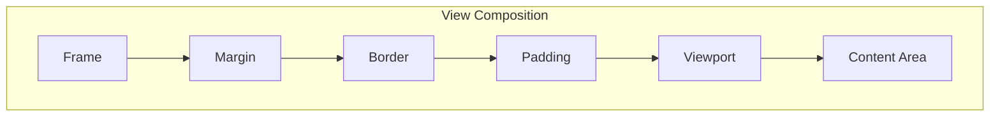

# Layout

Terminal.Gui provides a rich system for how View objects are laid out relative to each other. The layout system also defines how coordinates are specified.

See View Deep Dive, Arrangement Deep Dive, Scrolling Deep Dive, and Drawing Deep Dive for more.

## Lexicon & Taxonomy

- Adornment: The Thicknesses that separate the Frame from the Viewport. There are three Adornments: Margin, Padding, and Border. Adornments are not part of the View's content and are not clipped by the View's ClipArea.
- Application-Relative: The dimensions and characteristics of the application; currently equivalent to Screen for full-screen apps.
- Border: The Adornment inside the Margin where a visual border and the View.Title are drawn and where user interaction for arrangement may occur.
- Content Area: A rectangle at location `0,0` whose size is set by `View.GetContentSize()` and defaults to the `Viewport` size. If larger than the `Viewport`, scrolling is enabled.
- Frame: A Rectangle that defines the location and size of the `View` relative to its SuperView (controlled by `X`, `Y`, `Width`, `Height`).
- Margin: The outermost Adornment; transparent by default and outside the Border.
- Padding: The Adornment inside the Border and outside the Viewport; scrollbars (if any) reside within Padding.
- Viewport: The rectangle describing the portion of the Content Area currently visible to the user.
- Thickness: A record describing widths for the four sides (top, right, bottom, left).
- Pos: The type used by `View.X` and `View.Y` (see below).
- Dim: The type used by `View.Width` and `View.Height` (see below).

## Arrangement Modes

See the Arrangement Deep Dive for details on Tiled/Tiling and Overlapped arrangements.

## Composition

A View is composed of layered regions (outer → inner):

1. Frame: The outermost rectangle that defines location and size.
2. Margin: Separates the Frame from neighboring views.
3. Border: Drawn inside the Margin; shows a border and Title.
4. Padding: Inside the Border and outside the Viewport; contains scrollbars if enabled.
5. Viewport: The visible portal into the Content Area.
6. Content Area: Where the view's actual content is drawn (origin always `0,0`).

## View Composition Diagram

The following Mermaid diagram represents the view composition layers:



The diagram illustrates how the Viewport is a "window" into the Content Area; making `Viewport.Location` positive scrolls the visible portion down/right within the content.

### Notes on Viewport settings

- `ViewportSettings.None` (default) constrains the viewport and keeps content fully visible.
- Use `ViewportSettings.AllowNegativeX` / `AllowNegativeY` to permit moving the viewport up/left of the content.
- Use `ViewportSettings.AllowXGreaterThanContentWidth` / `AllowXGreaterThanContentHeight` to allow the viewport to be larger than the content.

## Layout Engine

### `View.Pos`

`Pos` supports multiple sub-types (all coordinates are relative to the SuperView's content area):

- `Pos.Absolute(int)` — absolute coordinate
- `Pos.Percent(int)` — percentage of the parent's view size
- `Pos.AnchorEnd(int)` — anchored from the end of the dimension
- `Pos.Center()` — centered
- `Pos.Left/Right/Top/Bottom(view)` — track another view's edge
- `Pos.Align(...)` — align with other views
- `Pos.Func(func)` — arbitrary function

`Pos` values can be combined with addition/subtraction, e.g. `view.X = Pos.Center() - 10`.

### `View.Dim`

`Dim` supports:

- `Dim.Auto()` — size based on content
- `Dim.Absolute(int)` — fixed size
- `Dim.Percent(int)` — percentage of SuperView's content area
- `Dim.Fill()` — fill remaining space
- `Dim.Width(view)` / `Dim.Height(view)` — reference another view's size
- `Dim.Func(func)` — function-based size

`Dim` values can be combined, e.g. `view.Width = Dim.Fill() - 10`.

## Examples

```csharp
var label1 = new Label () { X = 1, Y = 2, Width = 3, Height = 4, Title = "Absolute" };

var label2 = new Label () {
    Title = "Computed",
    X = Pos.Right (otherView),
    Y = Pos.Center (),
    Width = Dim.Fill (),
    Height = Dim.Percent (50)
};
```

## See Also

- Navigation
- Arrangement
- Scrolling
- Drawing
- View Deep Dive

---

*Content converted from https://gui-cs.github.io/Terminal.Gui/docs/layout.html (main body).*